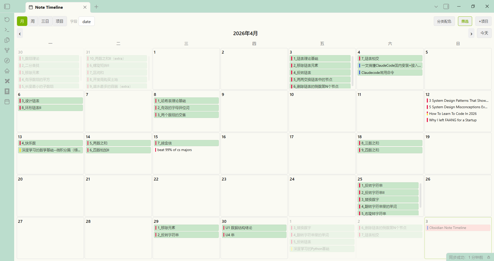
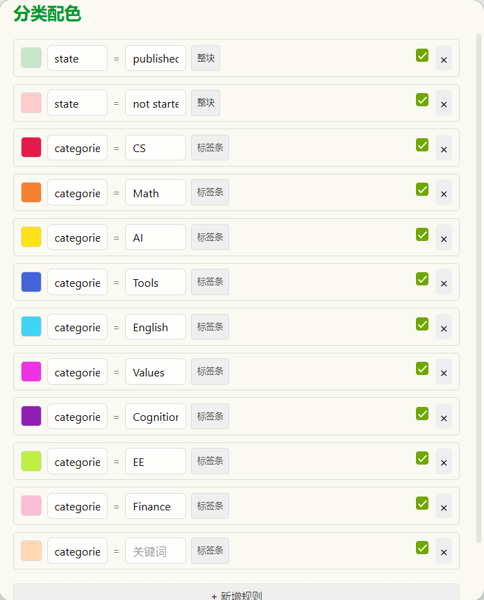
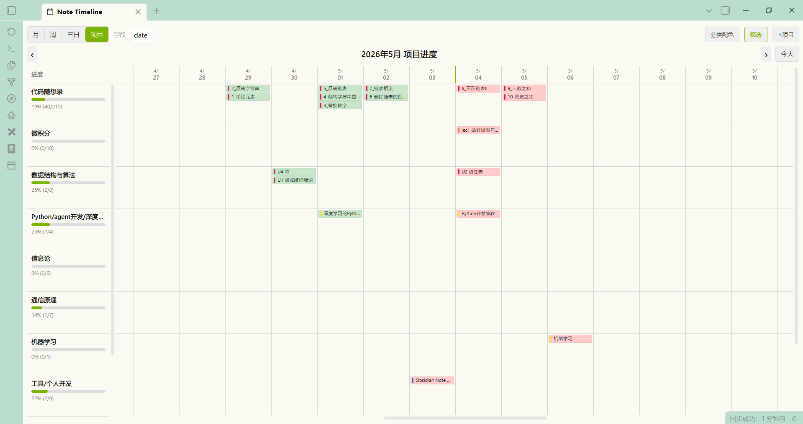
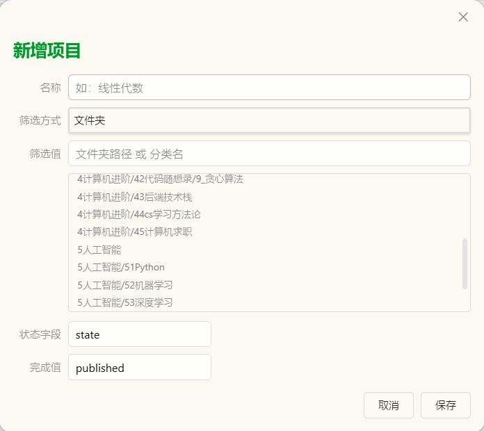

# Note Timeline — Obsidian 笔记时间线插件

> ⚠️ **本项目已归档，不再维护。功能已迁移至 [Task Calendar](https://github.com/BornfreeYan/obsidian-task-calendar)。**
>
> Task Calendar 是 Note Timeline 的彻底重构版，从"笔记日历"转变为"任务日历"，支持 Obsidian Task 语法（`🛫` 起始、`📅` 终止）、多日任务跨天长条、拖拽调整日期等全新功能。
>
> 如需继续使用基于 frontmatter 的笔记日历，可保留当前版本；如需任务管理功能，请迁移至 Task Calendar。

---

一款以**月/周/三日/项目时间线**四种视图展示笔记的 Obsidian 插件，支持拖拽改期、条件配色、筛选排除和项目进度管理。

---

## 快速开始

### 安装

1. 下载发布包中的 `main.js`、`manifest.json`、`styles.css`
2. 放入 Obsidian vault 的 `.obsidian/plugins/note-timeline/` 目录
3. 重启 Obsidian，在设置 → 第三方插件中启用

### 使用

- 点击左侧 Ribbon 日历图标，或执行命令面板中的 `Open note timeline`
- 插件读取笔记的 **frontmatter 日期字段**（默认 `date`，可自定义），自动归类到对应日期

---

## 功能概览

### 四种视图

Toolbar 左侧分段按钮切换：

| 视图 | 说明 | 导航 |
|------|------|------|
| **月** | 5行×7列月历，相邻月份补足空格 | ±1 月 |
| **周** | 周一~周日 七列 | ±7 天 |
| **三日** | 昨天 / 今天 / 明天 | ±1 天 |
| **项目** | 项目时间线，前30天~后30天 | ±1 天 |

月视图：


### 拖拽改期

- 日历中按住文件名块，拖到另一个日期格子
- 自动修改笔记 frontmatter 中的日期字段
- 支持纯日期 (`date: 2026-05-03`) 和带时间的 ISO 格式 (`"2026-05-03T10:00:00+08:00"`)

### 右键新建笔记

任意日期格子右键 → 新建笔记，自动填充 frontmatter 日期字段并打开编辑。

### 实时刷新

文件修改/删除/创建时日历自动更新（250ms 防抖）。

---

## 分类配色

Toolbar **分类配色** 按钮 → 配置条件颜色规则。


### 规则格式

```
[颜色]  字段名  =  关键词  [标签条/整块]  [启用]
```

每条规则支持两种**显示模式**：

| 模式 | 效果 | 适用场景 |
|------|------|------|
| **标签条** | 文件名左侧 3px 色条，最多 3 条 | 多分类并存（如 `categories=CS`）|
| **整块** | 文件名块整体覆盖颜色 | 状态标记（如 `state=published`）|

### 匹配逻辑

- 字段值支持**单值** (`categories: CS`) 和**列表** (`categories: [CS, Math]`)
- **不区分大小写**，**精确匹配**关键词
- 整块模式：同文件多条规则只取第一条匹配
- 颜色从预设 20 色板选择（含 4 个浅色推荐色用于整块模式）

### 排序

同日文件按规则顺序排列：符合第一条规则的在上方，未匹配任何规则的在最下方。

---

## 筛选排除

Toolbar **筛选** 按钮 → 添加排除规则。

- **文件名包含** 或 **路径包含** 关键词
- 匹配的文件**完全不显示**在日历中
- 激活时筛选按钮高亮
- 筛选规则对项目视图同样生效

---

## 项目视图


Toolbar 切换至 **项目** 视图，[+项目] 新建项目：


### 项目配置

| 字段 | 说明 |
|------|------|
| 名称 | 项目显示名 |
| 筛选方式 | 文件夹 / 分类 |
| 筛选值 | 文件夹路径（提供目录选择器）或分类名 |
| 状态字段 | 进度统计字段，默认 `state` |
| 完成值 | 完成态的值，默认 `published` |

### 布局

```
┌─ 固定左栏  ─────────┬─ 时间线（水平滚动）──────────────┐
│ 项目名              │ 4/30  5/1  5/2  █5/3█  5/4 ...  │
│ ████████░░ 75%      │  文件块堆叠                     │
│ (15/20)             │                                 │
└─────────────────────┴─────────────────────────────────┘
```

- 左侧 170px：项目名 + `<progress>` 进度条 + 百分比 + 计数
- 右侧：前30天~后30天时间线，默认显示10列左右（前3天+今天+后6天），水平滚动
- 今天列高亮
- 文件块样式与日历一致（整块底色+标签条），点击打开文件
- 100% 完成项目自动沉底 + 浅灰弱化
- 左右两侧垂直滚动同步
- header 吸顶，日期与格子永不分离

### 进度统计

```
进度 = 状态字段等于完成值的文件数 / 项目内全部 md 文件数 × 100%
```

筛选排除规则对项目文件同样生效，进度和显示保持一致。

---

## 自定义日期字段

Toolbar **字段** 输入框，默认 `date`。可改为任意 frontmatter 字段名（如 `created`、`due`），即时生效。

---

## AI 预留

`settings.ts` 已定义 `AIConfig` 接口（OpenAI-compatible），包含 `endpoint`、`apiKey`、`model` 字段，待下阶段实现。

---

## 技术架构

| 层 | 技术 |
|---|------|
| 运行时 | Obsidian Plugin API |
| 语言 | TypeScript 4.7 |
| 构建 | esbuild 0.17（打包为 `main.js`） |
| 样式 | 原生 CSS（CSS Grid + Flexbox） |
| 日期 | 原生 `Date` + 正则替换（零额外依赖） |

### 源码文件

```
calendar.ts           — 月/周/三日视图渲染 + 工具栏 + 导航 + 右键菜单
view.ts               — CalendarView 主视图 + 文件发现 + 配色匹配 + 项目数据
main.ts               — 插件入口 + 设置持久化
settings.ts           — 所有类型定义 + 预设色板（ColorRule / FilterRule / Project / AIConfig）
colorRulesModal.ts    — 分类配色规则管理弹窗 + 内联颜色选择器
filterModal.ts        — 筛选排除规则管理弹窗
projectModal.ts       — 项目管理弹窗 + 文件夹选择器
projectTimeline.ts    — 项目时间线渲染 + 滚动同步
styles.css            — 全部样式
esbuild.config.mjs    — 构建配置
manifest.json         — 插件清单
```

### 构建

```bash
npm install        # 安装依赖
npm run build      # 类型检查 + esbuild 生产构建
npm run dev        # 开发模式（文件变更自动构建）
```

---

## 迁移至 Task Calendar

**[Task Calendar](https://github.com/BornfreeYan/obsidian-task-calendar)** 是 Note Timeline 的下一代版本，主要变化：

- **数据模型**：从文件 frontmatter 改为 Obsidian Task 语法（`- [ ] 任务描述 🛫 日期 📅 日期`）
- **多日支持**：跨天任务显示为连续长条，可拖拽调整起止日期
- **任务状态**：已完成任务自动灰显+删除线，沉底显示
- **视图精简**：聚焦月/周视图，移除三日和项目视图
- **查询路径**：GUI 配置扫描路径，支持单文件或 Daily Notes 文件夹

旧用户如需保留笔记日历功能，可继续使用本仓库的归档版本。如需任务管理，请安装 Task Calendar。

---

## 许可证

MIT
